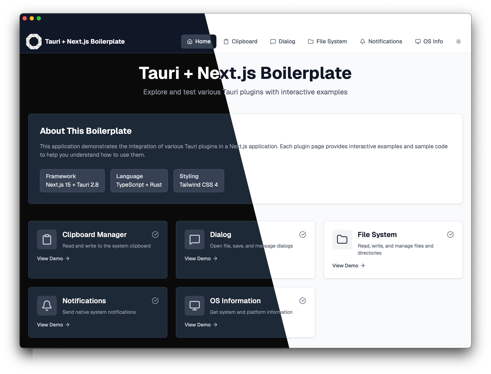

# Tauri + Next.js Boilerplate

- [Tech Stack & Features](#tech-stack--features)
- [Prerequisites](#prerequisites)
- [Installation & Setup](#installation--setup)
- [Available Scripts](#available-scripts)
- [Building for Production](#building-for-production)

## About


A modern desktop application boilerplate built with Tauri and Next.js. This template combines the power of Rust-based Tauri for native desktop capabilities with Next.js for building fast, modern web interfaces.

## Documentation

Guides to help you understand and customize this boilerplate:

- [Tauri Plugins & Demo Pages](docs/plugins.md) - Overview of included plugins and their demo pages
- [GitHub Releases (Automated)](docs/releases.md) - How to set up automated releases
- [Project Structure](docs/project-structure.md) - Understanding the project organization
- [Customization](docs/customization.md) - Customize menus, About window, and app metadata


## Tech Stack & Features

### Frontend
- **Next.js 15.5** - React framework with App Router
- **React 19.1** - Latest React with server components support
- **TypeScript 5** - Type-safe development
- **Tailwind CSS 4** - Utility-first CSS framework with PostCSS
- **Lucide React** - Beautiful, consistent icon library
- **Turbopack** - Next-generation bundler for faster development

### Backend/Desktop
- **Tauri 2.8** - Build smaller, faster, and more secure desktop applications
- **Rust** - Systems programming language for performance and safety

### Included Tauri Plugins
- **Clipboard Manager** - Read and write clipboard content
- **Dialog** - Native file dialogs and message boxes
- **File System** - Secure file operations
- **Notification** - Desktop notifications
- **OS** - System and platform information
- **Log** - Application logging

### Key Features
- Cross-platform desktop app (Windows, macOS, Linux)
- Small binary size compared to Electron
- Native performance with Rust backend
- Modern React development experience
- Hot module reloading for rapid development
- Type-safe communication between frontend and backend
- ESLint configured for code quality
- Pre-configured Tauri plugins with interactive demo pages
- Modern UI with Tailwind CSS and Lucide icons


## Prerequisites

Before you begin, ensure you have the following installed:

- **Node.js** (v20 or higher recommended)
- **pnpm** (v8 or higher)
  ```bash
  npm install -g pnpm
  ```
- **Rust** (latest stable version)
  ```bash
  curl --proto '=https' --tlsv1.2 -sSf https://sh.rustup.rs | sh
  ```
- **System Dependencies** (for Tauri)
  
  **macOS:**
  ```bash
  xcode-select --install
  ```
  
  **Linux:**
  ```bash
  sudo apt update
  sudo apt install libwebkit2gtk-4.1-dev \
    build-essential \
    curl \
    wget \
    file \
    libxdo-dev \
    libssl-dev \
    libayatana-appindicator3-dev \
    librsvg2-dev
  ```
  
  **Windows:**
  - Install [Microsoft C++ Build Tools](https://visualstudio.microsoft.com/visual-cpp-build-tools/)
  - Install [WebView2](https://developer.microsoft.com/en-us/microsoft-edge/webview2/)

## Installation & Setup

1. **Clone the repository:**
   ```bash
   git clone https://github.com/tarikkavaz/tauri-app-boilerplate.git
   cd tauri-app-boilerplate
   ```

2. **Install dependencies:**
   ```bash
   pnpm install
   ```

3. **Generate custom app icons (optional):**
   To use your own app icon, place a PNG file named `app-icon.png` in the root directory and run:
   ```bash
   pnpm tauri icon
   ```
   This will automatically generate all required icon sizes and formats for all platforms (Windows, macOS, Linux, Android, iOS) from your source image.

4. **Customize your app name:**
   Before starting development, update the hardcoded app names throughout the project. Replace the following values with your chosen app name:

   **package.json:**
   ```json
   "name": "your-app-name"
   ```

   **src-tauri/tauri.conf.json:**
   ```json
   "productName": "your-app",
   "identifier": "com.yourname.your-app"
   ```
   
   Note: The `identifier` must be unique and follow reverse domain notation (e.g., `com.yourcompany.appname`). The default `com.tauri.dev` is not allowed for production builds.

   **Optional - .github/workflows/release.yml:**
   If you plan to use GitHub Actions for releases, ensure the workflow is properly configured for your app name.

5. **Run the development server:**
   ```bash
   pnpm tauri:dev
   ```
   
   This will:
   - Start the Next.js development server with Turbopack
   - Compile the Rust backend
   - Launch the Tauri desktop application
   - Enable hot-reload for both frontend and backend changes

6. **Access the app:**
   The desktop application window will open automatically. The Next.js dev server runs on `http://localhost:3000` (visible in the Tauri window).

## Available Scripts

- `pnpm dev` - Run Next.js development server only
- `pnpm tauri:dev` - Run the full Tauri app in development mode
- `pnpm tauri:build` - Build the production-ready desktop application
- `pnpm build` - Build Next.js for production
- `pnpm lint` - Run ESLint to check code quality

## Next Steps

- Explore the [demo pages](docs/plugins.md) (`/clipboard`, `/dialog`, `/filesystem`, `/notifications`, `/os-info`) to see plugin examples
- Edit `src/app/page.tsx` to customize your main page
- Review the [customization guide](docs/customization.md) to personalize your app (includes menu customization)
- Modify `src-tauri/src/lib.rs` to add custom Rust commands and native functionality
- Configure app metadata in `src-tauri/tauri.conf.json`
- Adjust plugin permissions in `src-tauri/capabilities/default.json` as needed
- Add additional Tauri plugins from the [plugin ecosystem](https://v2.tauri.app/plugin/)
- Set up [automated releases](docs/releases.md) with GitHub Actions

## Building for Production

To create a production build of your desktop application:

```bash
pnpm tauri:build
```

This will:
- Build an optimized Next.js production bundle
- Compile the Rust code with optimizations
- Generate platform-specific installers:
  - **macOS**: `.dmg` and `.app` in `src-tauri/target/release/bundle/`
  - **Windows**: `.msi` and `.exe` in `src-tauri/target/release/bundle/`
  - **Linux**: `.deb`, `.AppImage` in `src-tauri/target/release/bundle/`


## Learn More

- [Tauri Documentation](https://v2.tauri.app/develop/) - Learn about Tauri features and APIs
- [Next.js Documentation](https://nextjs.org/docs) - Learn about Next.js features and APIs
- [Tauri + Next.js Guide](https://v2.tauri.app/start/frontend/nextjs/) - Integration guide

## License

This project is open source and available under the [MIT License](LICENSE).
